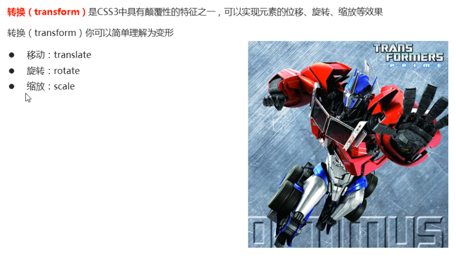
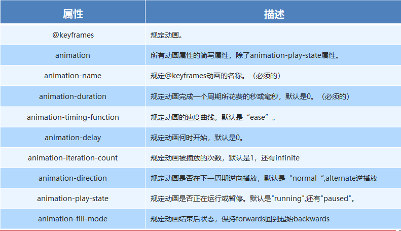
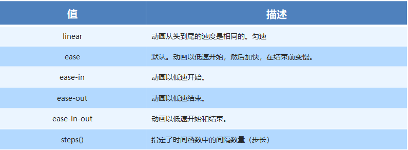

# day01 - 移动web开发_H5C3

## 1.1. 2D转换（变换）transform



2d转换是改变标签在**2维平面**上的**位置和形状**的一种技术，先来学习2维坐标系

### 1.1.1. 2维坐标系

**2维坐标系**其实就是指布局的时候的坐标系 如图


### 1.1.2. 2d移动 translate

2d移动是2d转换里面的一种功能，可以改变元素在页面中的位置，类似 **定位**

使用2d移动的步骤：

1. 给元素添加 **转换属性**  `transform`
2. 属性值为 `translate(x,y)`  如  `transform:translate(50px,50px)`;

```css
transform: translate(x,y) 或者分开写
transform: translateX()
transform: translateY()

div{
    transform: translate(50px,50px);
  }


```


#### 1.1.2.1. 小结

1. **translate**中的百分比单位是相对于自身元素的  `translate:(50%,50%);`
2. **translate**类似定位，不会影响到其他元素的位置
3. 对行内标签没有效果

### 1.1.3. 2d旋转 rotate

2d旋转指的是让元素在2维平面内顺时针旋转或者逆时针旋转。


使用步骤：

1. 给元素添加转换属性 `transform`
2. 属性值为 `rotate(度数)`  如 `transform:rotate(30deg)`  顺时针方向旋转**30度**，正数为顺时针，负数为逆时针。

```css
div{
      transform: rotate(0deg);
}
```

在浏览器中手动修改 **rotate**


观察过后，2d旋转有以下特点

1. 角度为正时 顺时针 负时 为逆时针
2. 默认**旋转的中心点**是元素的中心点

### 1.1.4. 转换中心 transform-origin

该属性可以修改元素旋转的时候的中心点

1. transform-origin:**50% 50%;**  默认值  元素的中心位置 百分比是相对于自身的宽度和高度
2. transform-origin:**top left;**  左上角   和 transform-origin：0 0;相同
3. transform-origin:**50px 50px;**  距离左上角 50px 50px 的位置
4. transform-origin：**0**;  只写一个值的时候  第二个值默认为 50%;

### 1.1.5. 2d缩放 scale

缩放，顾名思义，可以放大和缩小。 只要给元素添加上了这个属性就能控制它放大还是缩小 

步骤：

1. 给元素添加转换属性 `transform`
2. 转换的属性值为 `scale(宽的倍数,高的倍数)`    如 宽变为两倍，高变为3倍 `transform:scale(2,3)`

```css
div{
    transform:scale(2,3);
}
```


#### 1.1.5.1. 小结

1. transform:scale(1,1) 放大一倍 相对于没有放大
2. transform:scale(2,2) 宽和高都放大了2倍
3. transform:scale(2)  只写一个参数 第二个参数则和第一个参数一样 相当于 scale(2,2)
4. transform:scale(0.5,0.5)  缩小 
5. transform:scale(-2,-2) 反向放大2倍    很少用负数 容易让人产生误解
6. **scale缩放最大的优势：**可以设置转换中心点缩放，默认以中心点缩放的，而且**`不影响其他盒子`**


### 1.1.6 综合写法


## 2.1. 动画 animation


初学者容易对 **动画** 和 **过渡** 傻傻分不清楚

过渡 只能看到一次变化过程 如 **宽度  1000px  变化到  100px** 

**动画 可以设置变化的次数 甚至是无数次**   


### 2.1.1. 使用步骤

1. 先在css中定义动画    
2. 给目标元素使用动画


```css
        /* 我们想页面一打开，一个盒子就从左边走到右边 */
        /* 1. 定义动画 */        
        @keyframes move {
            /* 开始状态 */
            0% {
                transform: translateX(0px);
            }
            /* 结束状态 */
            100% {
                transform: translateX(1000px);
            }
        }
        div {
            width: 200px;
            height: 200px;
            background-color: pink;
            /* 2. 调用（使用）动画 */
            /* 动画名称 */
            animation-name: move;
            /* 持续时间 */
            animation-duration: 2s;
        }
```

### 2.1.2. 动画序列


```css
        /* 动画序列 */
        /* 1. 可以做多个状态的变化 keyframe 关键帧 */
        /* 2. 里面的百分比要是整数 */
        @keyframes move {
            0% {
                transform: translate(0, 0);
            }
            25% {
                transform: translate(1000px, 0)
            }
            50% {
                transform: translate(1000px, 500px);
            }
            75% {
                transform: translate(0, 500px);
            }
            100% {
                transform: translate(0, 0);
            }
        }
        
        div {
            width: 100px;
            height: 100px;
            background-color: pink;
            animation-name: move;
            animation-duration: 10s;
        }
```


### 2.1.3 常用动画属性



1. 动画名

   设置要使用的动画名 `animation-name:xxx;`

2. 持续时间

   设置动画播放的持续时间  `animation-duration:3s`

3. 速度曲线

   和设置过渡的速度曲线一样 `animation-timing-function:linear;`

   - linear： 匀速
   - ease： 慢-快-慢  默认值
   - ease-in： 慢-快。
   - ease-out： 快-慢。
   - ease-in-out： 慢-快-慢。

4. 延迟时间

   `animation-delay: 0s;`

5. 循环次数

   设置动画播放的循环次数  `animation-iteration-count: 2;`  **infinite** 为无限循环

6. 循环方向

   `animation-direction`

   1. **normal**  默认值 ，正向运行 
   2. **reverse** 反向运行
   3. **alternate**  正-反-正... 
   4. **alternate-reverse**  反-正-反..   
   5. 以上与循环次数有关

7. 动画等待或者结束的状态

   `animation-fill-mode` 设置动画在等待或者结束的时候的状态

   - **forwards**：动画结束后，元素样式停留在 100% 的样式
   - **backwards**： 在延迟等待的时间内，元素样式停留在 0% 的样式
   - **both**： 同时设置了 forwards和backwards两个属性值

8. 暂停和播放

   `animation-play-state`  控制 **播放** 还是 **暂停** 

   `running` 播放   `paused` 暂停

### 2.1.3. 动画简写


```css
animation: name duration timing-function delay iteration-count direction fill-mode;
```


### 2.1.4. 速度曲线细节

animation-timing-function：规定动画的速度曲线，默认是“ease”



```css
        div {
            overflow: hidden;
            font-size: 20px;
            width: 0;
            height: 30px;
            background-color: pink;
            /* 让我们的文字强制一行内显示 */
            white-space: nowrap;
            /* steps 就是分几步来完成我们的动画 有了steps 就不要在写 ease 或者linear 了 */
            animation: w 4s steps(10) forwards;
        }
        
        @keyframes w {
            0% {
                width: 0;
            }
            100% {
                width: 200px;
            }
        }
```

### 2.1.5 多个动画写法

用逗号分隔

```css
animation:
name duration timing-function delay iteration-count direction fill-mode，
name duration timing-function delay iteration-count direction fill-mode;
```

