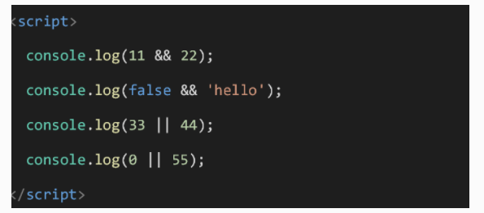
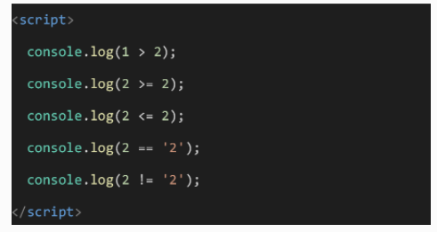

# 一、每日作业-JavaScript第02天

## switch-case语句练习

请用户输入1个星期数. 就将对应的英文的星期打印出来. 

- 比如用户输入'星期一'， 则 页面可以打印  monday 
- 英文自己查有道. 比如星期一是  monday  星期二是 tuesday（★）

## if-else if-else多分支语句练习

接收用户输入的分数，根据分数输出对应的等级字母 A、B、C、D、E。其中：（★）

*  90分(含)以上 ，输出：A
     80分(含)~ 90 分(不含)，输出：B	
     70分(含)~ 80 分(不含)，输出：C 	
     60分(含)~ 70 分(不含)，输出：D   	
*  60分(不含) 以下，输出 E

## 循环大练习

1. 打印0-20之间的整数, 将每个数输出到控制台
2. 计算1-1000之间的和
3. 打印 100-200之间,可以被6整除的数字
4. 用户输入一个数，  计算 1 到这个数的和。 
   - 比如 用户输入的是 5， 则计算 1~5 之间的累加和
   - 比如用户输入的是10， 则计算 1~10 之间的累加和

## 用户登录验证

题目描述：

- 接收用户输入的用户名和密码，若用户名为 “admin” ,且密码为 “123456” ,则提示用户登录成功!  否则，让用户一直输入。

- 先不要看答案：

  ~~~javascript
  while (true) {
      let msg = prompt('名字')
      let pwd = prompt('密码')
      if (msg === 'admin' && pwd === '123456') {
          break
      }
  }
  alert('登录成功')
  ~~~

  ​

## 简答题：关键字汇总( 能够简单的说出来这些关键字干啥用的 )

* let    声明变量
* typeof   检测数据类型
* if   条件语句如果
* else   否则 
* switch    分支语句   
* case   事件
* default      默认语句
* while  循环    
* break 结束    
* continue 跳出本次继续循环   

##  拓展题

小伙伴可以自己挑战一下，或者看着答案梳理代码执行过程。

用户输入年份和月份，打印出这个月有多少天（★）

- 其中1,3,5,7,8,10,12月有31天
- 4,6,9,11月有30天
- 2月比较特殊，如果是平年就是28天，闰年就是29天（闰年判断条件 ： 能被400整除 或者 能被4整除且不能被100整除）

答案：

~~~javascript
 let year = +prompt('请输入年份')
 let month = +prompt('请输入月份')
 let day = null //先声明一个变量存储天数,因为需要修改里面的值，所以用let

 switch (month) {
     case 1:
     case 3:
     case 5:
     case 7:
     case 8:
     case 10:
     case 12:
         day = 31
         break
         case 1:
         case 4:
     case 6:
     case 9:
     case 11:
         day = 30
         break
         case 2:
         if (year % 400 === 0 || (year % 4 === 0 && year % 100 !== 0)) {
             day = 29
         } else {
             day = 28
         }
         break
 }

alert(`${year}年的${month}月有${day}天`)
~~~

## 检测题

1. if...else语句的if和else两个句子里的代码能同时被执行吗?

   ### A： 不可以，因为两个条件不同

    B： 有时候可以，有时候不可以

    C： 2个都不能执行

    D： 可以，因为条件是并列的

2. switch (2){case 1: console.log(1) break; case 2: console.log(2); default: console.log(3) break;}的输出结果是

    A： 3

   ###  B： 2 3

    C： 1 2 3

    D： 2

3. 结束当前循环,继续进行下一次循环的关键词是()

   A： break

   ###  B： continue

    C： end

    D： return

4. 以下哪些情况可能会出现死循环()(多选)

   ###  B： while(true){}

    B： while(true){}

    C： while(0){}

   ###  D： while("itcast"){}

5. 以下while循环的次数是()

   let i = 0;

   while (i===1){

    i++

   }

   A： 无限次

    B： 有语法错 不能执行

   ###  C： 一次也不执行

    D： 执行一次

6. 下列哪个运算符需要同时对 值 与 类型 来比较是否相等？

   A： =

    B： ==

   ###  **C： ===**

    D： !=

7.  运算结果是？

    A: 	 22   hello  33  55

    B： 11   hello  33  55

    C： 22   false  33  0

   ###  **D： 22   false 33  55**

8. 请将下列内容正确匹配,并将对应的字母编号填写到括号中 ( )逻辑运算符 a. -- ( )比较运算符 b. - ( )一元运算符 c. == ( )算数运算符 d. || 左侧括号内从上向下正确的顺序是（）

   A：  abcd

    B： dcab

    C： bcda

   ###  **D： dbca**

9.   运算结果正确的是？

   ### A： **false  true  true  true  false**

    B： false  true  true  false  false

    C： false  true  true  true  true 

    D： false  false  false  true false

10. 用break语句可以使流程跳出switch语句体，也可以用break语句在循环结构终止本层循环体，从而提前结束本层循环

   #### 对

11. continue 不会打断当次循环执行。

   #### 错

   ​

