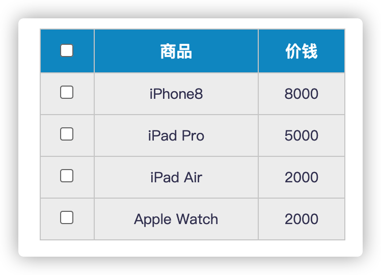
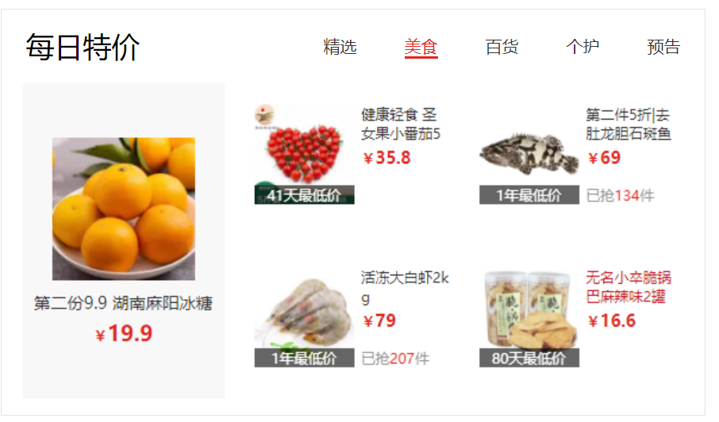
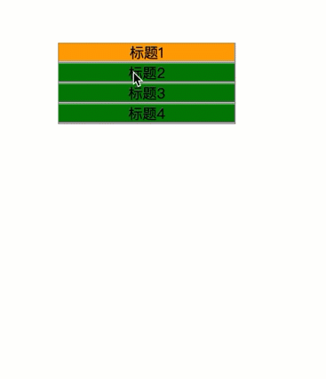
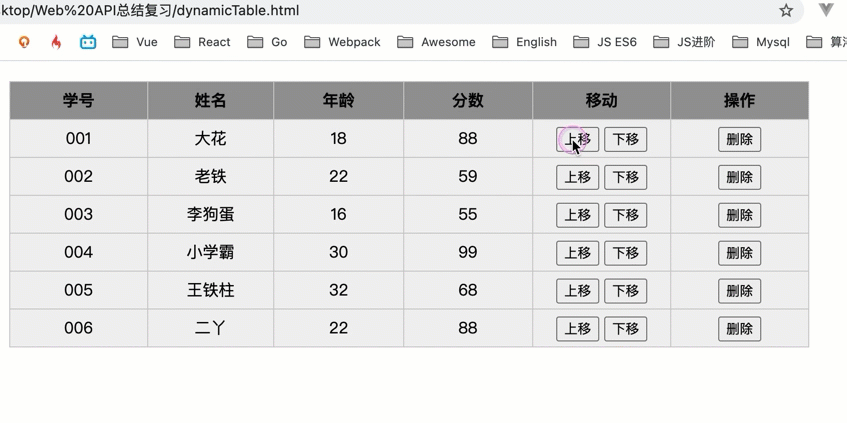

### 姓名	：黄若峰 

### 分数	：

---

希望大家做选择和简答题部分时，不要把代码放在VSCode或浏览器上运行得出答案，全靠自觉哈~ 考试分数不重要，重点是掌握知识点，查漏补缺。

！！ 注意，同学们记得边做边保存文件！！ Ctrl + S 保存！！

代码题在文件夹中有对应的html文件哈！


## 一、单选题（共30题，总分60分）

##### 1. 关于DOM中获取元素的方法，下列说法正确的是？   （B ）

A: 	document.querySelector('.box') 是获取页面所有的元素

B: 	document.querySelector('.box') 是获取页面第一个类名为box的元素

C: 	document.querySelectorAll('.box') 是获取页面最后一个类名为box的元素

D: 	document.querySelector('.box') 是获取页面所有类名为box的元素


##### 2. 关于js中的事件，下列说法错误的是？ (  A )

A:	元素不能注册同名事件,比如给同一个按钮同时注册2个点击事件

B:	事件注册之后，比如点击，鼠标经过等事件，不会立即触发

C:	页面中DOM元素是都可以注册事件的

D:	事件既可以通过用户交互来触发，也可以使用代码主动触发,比如 btn.click()


##### 3. 关于innerText与innerHTML下列说法正确的是？ ( D)

A:	innerText与innerHTML作用完全一致，没有任何区别

B:	innerText属性里设置的标签可以被解析

C:	innerText获取内容的时候，如果内容中有HTML标签，标签会被正常解析

D:	innerHTML获取内容得到的是一个包含HTML标签的字符串


##### 4. 关于window对象，下列说法错误的是?    	（ D	）

A:	window对象是浏览器里的顶级对象

B:	window对象的属性和方法在调用时，可以省略window

C:	console.log(window.document === document) 这行代码会打印true

D:	window对象的load事件会在页面DOM树加载完毕后立马执行


##### 5.  下列选项关于事件委托说法错误的是？B 

A: 事件委托可以解决事件绑定程序过多的问题

B: 事件委托利用了事件捕获原理

C: 事件委托可以提高代码性能

D: 事件委托可以应用在click, mousemove等事件中


##### 6. 下面代码输出什么 C

```js
var i ;
for (var i = 0; i < 3; i++) {
    setTimeout(function () {
        console.log(i);
    }, 1);
}
for (let i = 0; i < 3; i++) {
    setTimeout(function () {
        console.log(i);
    }, 1);
}
```

A:  0 1 2             0 1 2

B:  0 1 2             3 3 3

C:  3 3 3             0 1 2

C:  3 3 3             3 3 3


##### 7. 下面代码输出什么？A

```js
let c = { greeting: "Hey!" };
let d = c;
c.greeting = "Hello";
console.log(d.greeting);
```

- A: `Hello`
- B: `undefined`
- C: `ReferenceError`
- D: `TypeError`


##### 8. cool_secret可以访问多长时间?A 

```js
sessionStorage.setItem("cool_secret", 123);
```

- A：永远，数据不会丢失。
- B：用户关闭选项卡时。 (页面)
- C：当用户关闭整个浏览器时，不仅是选项卡。
- D：用户关闭计算机时。


##### 9.  下面输出正确的是 C
```js
console.log('开始执行');
setTimeout(function(){
  console.log('timeout1')
},0);
console.log("结束了")
```

- A：开始执行，timeout1，结束了
- B：timeout1，开始执行，结束了
- C：开始执行，结束了，timeout1
- D:  以上都不对


##### 10. 下面打印name值是多少  A
```js
var name = "jimmy";
var a = {
    name: "chimmy",
    fn : function () {
        console.log(this.name); 
    }
}
console.log(window.name) 
a.fn(); 
```

A:  jimmy    	chimmy

B:  jimmy 		jimmy

C: chimmy		jimmy

D: chimmy		chimmy		


##### 11. 下边这代码输出的结果是：（ D ）

```js
function showCase(value) {
    switch(value) {
    case 'A':
        console.log('Case A');
        break;
    case 'B':
        console.log('Case B');
        break;
    case undefined:
        console.log('undefined');
        break;
    default:
        console.log('Do not know!');
    }
}
showCase(new String('A'));

```
A、Case A

B、Case B

C、undefined

D、Do not know!


##### 12. 下边代码输出的结果是（ D	）

```js
var val = 'smtg';
console.log('Value is ' + (val === 'smtg') ? 'Something' : 'Nothing');
```

A: Value is Something

B: Value is Nothing

C: NaN

D: other


##### 13. 下边代码输出的结果是  （ D	 ）

```js
var name = 'World!';
(function () {
    if (typeof name === 'undefined') {
        var name = 'Jack';
        console.log('Goodbye ' + name);
    } else {
        console.log('Hello ' + name);
    }
})(); 

```

A: Goodbye Jack

B: Hello Jack

C: Hello undefined

D: Hello World


##### 14. 以下js操作Array的方法中不能添加元素的是：（	 B  ）

A、push

B、pop

C、unshift

D、splice


##### 15. var arr = [];   typeof arr 的结果是(   C )

A、array

B、function

C、object

D、undefined


##### 16. 以下代码执行后，console 的输出是  A

```js
function Foo(){
	console.log(this.location);
}
Foo();
```

A、当前窗口的 Location 对象

B、undefined

C、null

D、TypeError


##### 17. 事件传播的三个阶段是什么 ？ D  

A:	目标 -->  捕获  -->  冒泡 

B:	冒泡  --> 目标 -->   捕获

C:    目标  --> 冒泡  -->  捕获

D:    捕获  --> 目标  -->  冒泡


##### 18. 下列事件哪个不是由鼠标触发的事件？ D

A、click

B、contextmenu

C、mouseout

D、keydown


##### 19. 下面数组的方法中，哪个方法不能改变自身数组  B

A、splice

B、concat

C、sort

D、pop


##### 20. 要在10秒后调用checkState，下列哪个是正确的 C

A、window.setTimeout(checkState, 10);

B、window.setTimeout(checkState(), 10);

C、window.setTimeout(checkState, 10000);

D、window.setTimeout(checkState(), 10000);


##### 21.以下不支持冒泡的鼠标事件为( ) C

A. mouseover 

B. click 

C. mouseleave 

D. mousemove


##### 22. 在javascript中，用于阻止默认事件的默认行为的方法是 C

A. **stopDeafault**() 

B. **stopPropagation**() 

C. **preventDefault**() 

D. **preventDefaultEven**()


##### 23. DOM中，给父节点添加子节点的正确方法为 D

A. **appendChild**(parentNode,newNode); 

B. **append**(parentNode,newNode); 

C. parentNode.**append**(newNode); 

D. parentNode.**appendChild**(newNode);


##### 24. **下列定义的 css 中，哪个权重是最低的？**C

A、#game .name

B、#game .name span

C、#game div

D、#game div.name


##### 25. Chrome浏览器中，获取鼠标单击页面位置的是（B）。

A. clientX和clientY

B. pageX和pageY

C. screenX和screenY

D. scrollLeft和scrollTop


##### 26. 正则表达式`/[am][efgr]/ig`匹配字符串“programmer”的结果是（D）。

A. am

B. er

C. ra

D. me


##### 27. 有正则表达式`/^\d{5,12}$/`,以下选项中能够匹配的是（C）

A、a100

B、8046976243181

C、80010

D、abcod


##### 28.在js中使用Date()对象中的哪个方法可以返回该日期对象对应的星期？（D）

A、getDate()

B、getFullYear()

C、getMonth()

D、getDay()


##### 29.页面有一个按钮button id为 button1，通过原生的js如何禁用 C

A: document.getElementById("button1").readolny= true;

B: document.getElementById("button1").setAttribute(“readolny”,”true”);

C: document.getElementById("button1").disabled = true;

D: document.getElementById("button1").getAttribute(“disabled”,”true”);


##### 30. 以下关于let和const的说法中正确的是 (多选   ： A,B,C  )

A. **let**声明的变量值和类型都可以改变 

B. **const**声明的常量不可以改变

C. 两者都不存在变量提升，同时存在暂时性死区，只能在声明的位置后面使用 

D. **const**可以先声明再初始化，可以后赋值

---


## 二、 简答题  （共11题，总分50分）

##### 1. 说一说 标准盒模型  IE盒模型 区别 ？   (4 分)

##### 标准盒模型(W3C)

浏览器渲染时是将网页元素看成一个一个的盒子处理，这些盒子称为盒模型，盒模型包括：1.content：内容部分

​		2.margin：外边距

​		3.padding：内边距

​	       4.border：边框

##### IE盒模型

盒模型不包括margin

##### 2. flex属性中的 0, 1, auto分别代表什么意思？（4分）

```css
flex: 0 1 auto;
```

```js
// 解答：
flex连写属性都是设置item的
1.0:flex-grow 指的是item的放大比例，当设置为0时，代表container即使有空白空间也不放大
2.1:flex-shrink 指的是item的缩小比例，当设置为1时，代表item即使总宽度超出container会自带缩小至container宽度
3.auto：flex-basis 指的是盒子的初始大小，优先级比width高，auto代表自动设置宽度，此时width有效
```


##### 3. 说一说事件委托的原理 ？（4分）

​	1.利用事件冒泡阶段

​	2.给父元素绑定事件监听可以监听到子元素的事件

​	优点：避免重复添加监听，优化代码


##### 4. 下面的代码打印什么内容 （4分）

```js
var a = 10
;(function(){
  console.log(a)   
  var a = 5
  console.log(window.a)  
  console.log(this.a)    
  a = 20
  console.log(a)        
})()

//this为函数(局部作用域)内部自带值
//普通函数的this：指向将该函数当做方法调用的对象--调用时确定
//箭头函数的this：定义箭头函数时的作用域的this对象---定义时确定
输出:10 10 10 20
```


##### 5. 下列程序的输出结果是什么？（4分）

```js
var x = 1

var obj = {
  x: 3,
  fun: function(){
    var x = 5
    return this.x
  }
}
var fun = obj.fun
console.log(obj.fun(), fun()) 

输出:3 1
```


##### 6.  e.target 和 e.currentTarget 的区别 ？（4分）

e.target:代表的是触发事件的元素

e.currentTarget:代表的是事件源

##### 7. sessionStorage 和 localStorage的区别？（4分）

1.生命周期：

1.localStorage中的数据生命周期为永久，直到手动删除数据或者其他重置浏览器操作。

2.sessionStorage的数据生命周期为单次访问，关闭浏览器数据生命周期结束

2.数据共享：

1.localStorage中的数据在同一个域名中的所有窗口共享数据

2.sessionStorage在单个窗口下共享数据

##### 8. 获取页面被卷去的头部有哪两种方式？ （4分)

1.document.documentElement.scrollTop

2.window.pageYoffset

##### 9. 水平垂直居中的方式？（6分）

1.flex:利用flex的container的justify-cotent：center和align-item：center进行水平垂直居中

2.margin:利用父元素relative和子元素absolute定位，设置子元素的四个方向的定位属性，再设置margin:auto完成水平垂直居中

3.transform：利用margin设置上左外边距为50%，再使用transform：translateX/Y:-50%（translate中的百分比为自身宽高）

4.文本水平垂直居中: 水平：text-align:center   垂直： line-height=文本盒子高度

#####  10. 讲一讲JS的执行机制呢？（6分）

1.JS执行一个任务时判断该任务是同步任务还是异步任务

2.同步任务在主线程中，通过执行栈进行

3.异步任务交给异步进程处理，满足条件将该异步任务放入任务队列中

4.当主线程的同步任务执行结束后，再不断去扫异步任务队列，将满足条件的任务拿出来执行

##### 11  基本数据类型有哪些？检测数据类型(基本类型，引用类型)的方式？（6分）

```js
// 解答：
基本数据类型:Number Boolean String Undefined Null Symbol Bigint
引用数据类型:Object
检测数据类型:1.typeof 数据
2.数据 instanceof 类
3.object.prototype.toString().call(数据)
```

---


## 三、 代码题 （共40分）

##### 1. 动态创建一个div， 满足以下条件。   （6分）

1. 用Javascript动态创建一个div元素，将id设置为“mydiv”。  
2. 并设置一个值为 “hello JS” 的自定义属性 data-self。        
3. 该div字体颜色为orange，字号18，内容为”Javascript DIV”。并将该元素追加到body中来显示。

```js
// 注意代码题可以先在vscode中运行，之后往这里粘贴js代码
const mydiv=document.createElement('div')
mydiv.setAttribute('data-self','hello JS')
mydiv.style.color='orange'
mydiv.style.fontSize='18px'
mydiv.innerText='Javascript DIV'
document.body.appendChild(mydiv)
```


##### 2. 实现表格的全选和反选功能   （6分）

需求：

1. 点击上面全选复选框，下面所有的复选框都选中（全选）
2. 再次点击全选复选框，下面所有的复选框都不中选（取消全选）
3. 如果下面复选框全部选中，上面全选按钮就自动选中
4. 如果下面复选框有一个没有选中，上面全选按钮就不选中




```js
// 此处粘贴代码
//获取元素
        const checkAll = document.querySelector('#j_cbAll')
        const checkboxs = document.querySelectorAll('#j_tb [type="checkbox"]')

        //全选功能实现
        checkAll.addEventListener('click', function () {
        checkboxs.forEach(el => el.checked = checkAll.checked)
        })
        //复选功能实现
        checkboxs.forEach((el, i) => {
        el.addEventListener('click', function () {
       	checkAll.checked = document.querySelectorAll('#j_tb input:checked').length === checkboxs.length ? true : false
            })
        })
```


##### 3. 实现tab栏切换功能  6分




```js
// 此处粘贴代码
//获取元素
    const tab = document.querySelector('.tab-nav')
    const content = document.querySelector('.tab-content')
    const as = document.querySelectorAll('.tab-nav li a')
    //添加自定义属性
    as.forEach((el, i) => el.setAttribute('data-id', i))
    //监听事件/事件委托
    tab.addEventListener('click', function (e) {
      if (e.target.tagName === 'A') {
        //排他思想，去除所有的active类
        document.querySelector('.tab-nav .active').classList.remove('active')
        //给自己添加active类名
        e.target.classList.add('active')
        //操作content中的内容
        //排他，去除所有的active类
        document.querySelector('.tab-content .active').classList.remove('active')
        //将content对应上tab栏的active
 content.children[e.target.dataset.id].classList.add('active')
      }
    })
```


##### 4. 请实现下面功能      6分



```js
// 此处粘贴代码
//获取元素
        const box = document.querySelector('.parentWrap')

        //事件监听/事件委托
        box.addEventListener('click', function (e) {
            if (e.target.tagName === 'SPAN') {
                //排他
                const boxs = document.querySelectorAll('.menuGroup div')
                boxs.forEach(el => el.style.display = 'none')
                e.target.nextElementSibling.style.display = 'block'
            }
        })
```


##### 5. 根据提供的数据，动态创建表格，并实现表格上下移动和删除的功能  （16分）



需求：

1. 动态创建表格

2. 表格行可上下移动，顶部上移第一条提示 --   已经到顶啦（不可再往上移动）

3. 表格底部下移最后一条提示 -- 已经到底啦 

4. 支持删除功能


可参考：

- 事件委托  `e.target`,    `innerHTML`
- document.createElement
- node.appendChild
- node.insertBefore
- node.parentNode
- node.children
- node.lastElementChild
- node.nextElementSibling
- node.previousElementSibling
- node.removeChild

**提示， 上下移动每一个tr， 可以用insertBefore() 实现 ， 当我们第一个参数是本身已存在的元素时， 可以做移动。**


```js
// 此处粘贴代码
//获取元素
    const table=document.querySelector('tbody')
    
    //动态创建表格
    let trs=data.map((el,i)=>{
    return `
            <tr>
                <td>${el.id}</td>
                <td>${el.name}</td>
                <td>${el.age}</td>
                <td>${el.score}</td>
                <td><button>上移</button><button>下移</button></td>
                <td><button>删除</button></td>
            </tr>`
        })
    table.innerHTML=trs.join('')
    //按钮功能实现
    //事件监听/事件委托
    table.addEventListener('click',function(e){
        if (e.target.tagName==='BUTTON') {
            //上移功能
            if(e.target.innerText==='上移'){
                if(e.target.parentNode.parentNode.previousElementSibling==null){
                    alert('已经到顶了')
                }
                else{
                table.insertBefore(e.target.parentNode.parentNode,e.target.parentNode.parentNode.previousElementSibling)
            }}
            //下移功能
            if(e.target.innerText==='下移'){
                try {
                    table.insertBefore(e.target.parentNode.parentNode,e.target.parentNode.parentNode.nextElementSibling.nextElementSibling)
                } catch (TypeError) {
                    alert('已经到底了')
                }
            }
            //删除功能
            if(e.target.innerText==='删除'){
                table.removeChild(e.target.parentNode.parentNode)
            }
        }
      })
```


