## flex

#### 1. flex-grow  扩展比例
flex-grow处理父元素在还有剩余空间时的分配规则

##### 01 子项只有一个的情况

默认为0 ， 表示这个子项不占用剩余空间。

```css
        .main {
            width: 500px;
            height: 300px;
            background: skyblue;
            display: flex;
        }
        .main div{
            width: 100px;
            height: 100px;
            background: pink;
            /* flex-grow: 0;  */
            /* flex-grow 默认就是0， 这个div盒子不占用剩余空间 */
            /* 如果比例值为1，表示占满剩余的所有空间 400*/
            /* 如果比例值为0.5，将剩余空间分为两份，取一半 200*/
            /* 当比例值大于等于1的时候，都会占满整个空间*/
            flex-grow:1;
        }
		/*100 + 200*/

    <div class="main">
        <div></div>
    </div>
```

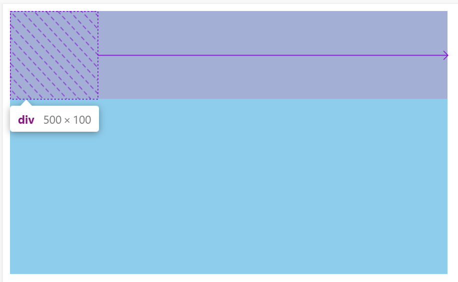


##### 02 子项有多个的情况

- 1. 其中一个子项写flex-grow :1 ,  那么它将占满所有剩余空间

```css
.container {
    width: 500px;
    height: 300px;
    background: skyblue;
    display: flex;
}
.item:nth-child(1){
    width: 200px;
    height: 100px;
    background: pink;
    flex-grow: 1;
    /*其中一个写flex-grow 1； 将占满所有剩余空间*/
}
.item:nth-child(2){
    width: 100px;
    height: 100px;
    background: pink;
}
```

2. 多个子项都写上flex-grow,  那么他们会将剩余空间先按份数均分，再分配每个子项需要扩展的数值。

- 分两种情况，所有子项，flex-grow和大于1时

```css
/*都大于1的情况*/
.item:nth-child(1){
    width: 200px;
    height: 100px;
    background: pink;
    flex-grow: 1;  
    /*剩余空间 200 ， 会被均分为3分，这个子项扩展1份的宽度，66.67； 宽度为200 + 66.67*/
}
.item:nth-child(2){
    width: 100px;
    height: 100px;
    background: pink;
    flex-grow: 2;
    /*flex-grow:2 ; 因为前一个子项也写了flex-grow，所以这个扩展的数值占剩余空间200的2/3，133.33*/
    /*这个子项宽度 100 + 200 * 2/3 */
}
```

```css
/*有小于1的情况， 但子项的flex-grow总和大于1*/
.item:nth-child(1){
    width: 200px;
    height: 100px;
    background: pink;
    flex-grow: 0.2;  
    /*剩余空间 200 ， 每一份：200/(0.2+2) = 90.91 ； 这个子项扩展数值为 0.2 * 90.91 = 18.18*/
}
.item:nth-child(2){
    width: 100px;
    height: 100px;
    background: pink;
    flex-grow: 2;
    /*flex-grow:2 ; 扩展数值 90.91 * 2 = 181.82 */
}
```

- 所有子项扩展比例flex-grow相加和小于0时，会引入1作为分母来计算。（最后分配完还有剩余空间）

```css
.container {
    width: 500px;
    height: 300px;
    background: skyblue;
    display: flex;
}
.item:nth-child(1){
    width: 200px;
    height: 100px;
    background: pink;
    flex-grow: 0.2;
    /* 剩余空间：200； 扩展数值：200*0.2/(0.2+0.3) = 20 */ Error
    /*扩展数值：200 *0.2 = 40 */
    /*width: 240px*/
}
.item:nth-child(2){
    width: 100px;
    height: 100px;
    background: pink;
    flex-grow: 0.3;
    /* 剩余空间：200； 扩展数值：200*0.3/(0.2+0.3) = 30 */ Error
    /*扩展数值 200 * 0.3/1 = 60 */
    /*width: 160px*/
}
```


#### 2. flex-shrink  收缩比例

flex-shrink处理父元素空间不足时，子元素的收缩规则。

flex-shrink 默认值为1， 表示flex容器空间不足时，元素的收缩比例。

##### 01 一个元素的情况

```css
.container{
    width: 500px;
    height: 200px;
    background-color: skyblue;
    display: flex;
}
.container div {
    /*子元素并没有超出父元素，收缩了100px*/
    width: 600px;
    height: 100px;
    background: pink;
    /*flex-shrink:1; 默认为1，自动收缩，跟容器大小相同，不写也生效*/
    /*flex-shrink:0; 那么写0；不让它自动收缩，也就是会溢出父元素*/

}
```

- flex-shrink:1; 默认为1，自动收缩

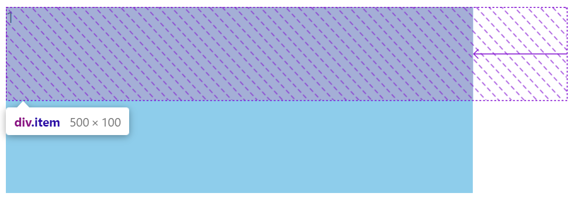

- flex-shrink：0； 不让它收缩。 按正常宽度来渲染，溢出部分也渲染了。

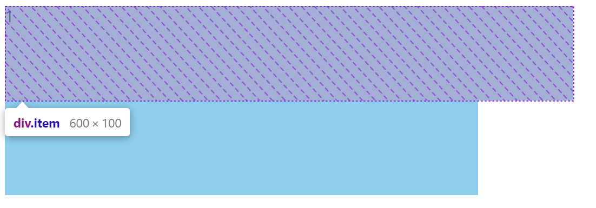

- flex-shrink: 0.5;  按比例收缩。 把剩余溢出的部分，按比例收缩。收缩了溢出空间的1/2。 

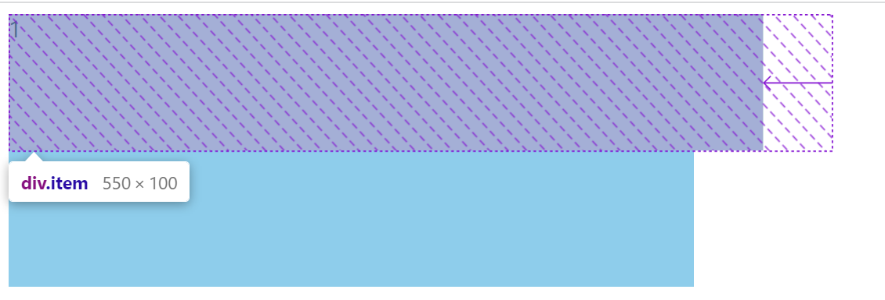

##### 02 多个元素的情况

```css
/*
父容器宽度500
子元素 300 + 400 ； 溢出了 200 px； 没设置flex-shrink也会自动缩放，但不是均分收缩。
*/
.container{
    width: 500px;
    height: 200px;
    background-color: skyblue;
    display: flex;
}
.item:nth-child(1) {
    width: 300px;
    height: 100px;
    background: pink;
}
.item:nth-child(2) {
    width: 400px;
    height: 100px;
    background: pink;
}
/*
按宽度计算
第一个子元素 300  第二个子元素 宽度 400
300 - 3/7 * 200（需要收缩的宽度85.71）  = 214.29
400 - 4/7 * 200 = 285.71
这是在flex-shrink不写，默认值表示1时。用溢出的宽度 * 各个子元素宽度占比
*/
<div class="container">
<div class="item">1</div>
<div class="item">2</div>
</div>
```

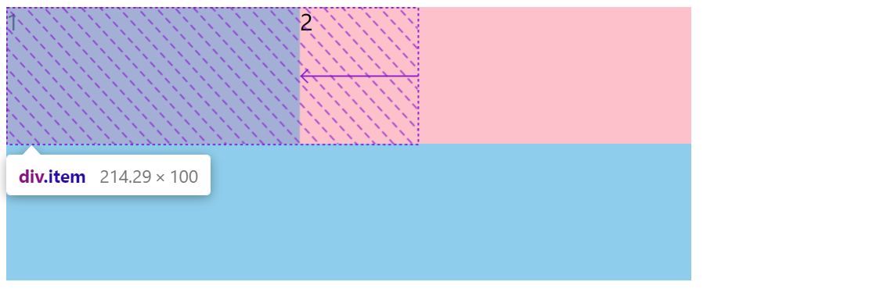

- 第一个flex-shrink 为 2， 第二个flex-shrink 为1. 按权重乘以宽度计算收缩比例。

  ```css
  .container{
      width: 500px;
      height: 200px;
      background-color: skyblue;
      display: flex;
  }
  .item:nth-child(1) {
      width: 300px;
      height: 100px;
      background: pink;
      flex-shrink: 2;
    /* 计算比例时：300 * 2 = 600 */  
  }
  .item:nth-child(2) {
      width: 400px;
      height: 100px;
      background: pink;
      flex-shrink: 1;
    /* 计算比例时， 400 * 1 = 400 */
  }
  /*
  第一个子元素： 占600的权重，收缩得更多；  第二个子元素 400；
  300 - 6/10 * 200（需要收缩的宽度） = 180
  400 - 4/10 * 200 （需要收缩的宽度）= 320
  */
  ```

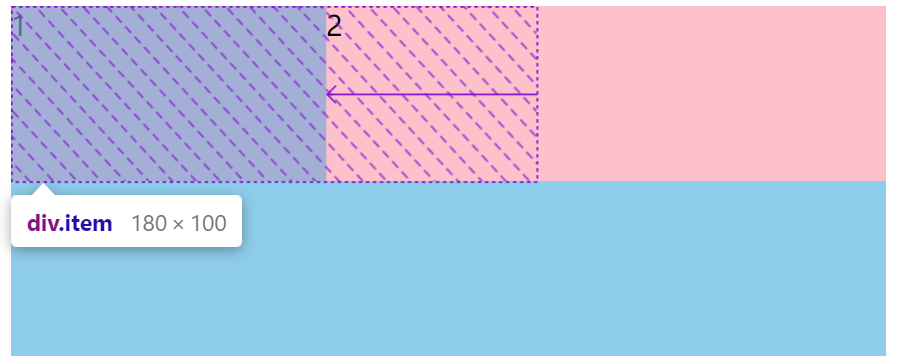

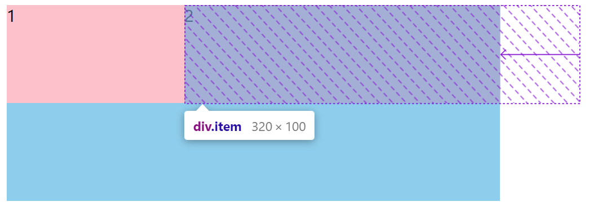

- 如果所有子项flex-shrink和小于1，只收缩溢出空间的一部分，表示还会溢出父盒子。

```css
.container{
    width: 500px;
    height: 200px;
    background-color: skyblue;
    display: flex;
}
.item:nth-child(1) {
    width: 300px;
    height: 100px;
    background: pink;
    flex-shrink: 0.2;
}
.item:nth-child(2) {
    width: 400px;
    height: 100px;
    background: pink;
    flex-shrink: 0.1;
}
/*
1.先计算总权重  总权重：每个子元素宽度*flex-shrink 累加
300 * 0.2 + 400 * 0.1 = 100

2.计算总收缩空间： 溢出值*（flex-shrink和）/ 1 
200px *(0.2+0.1)/1 = 60 px
两个元素收缩总和并不是200，而是只会收缩 200px 的 （0.2+0.1）/ 1 = 60

3.计算每个子元素收缩空间
60px * (0.2*300)/(0.2 * 300 + 400 * 0.1) = 36 px
60px * (0.1*400)/(0.2 * 300 + 400 * 0.1) = 24 px

第一个子元素 占比  0.2 * 300 / 100
第二个子元素 占比  0.1 * 400 / 100

第一个元素最终宽度 300 - 36 = 264px
第二个元素最终宽度 400 - 24 = 376px
*/
```

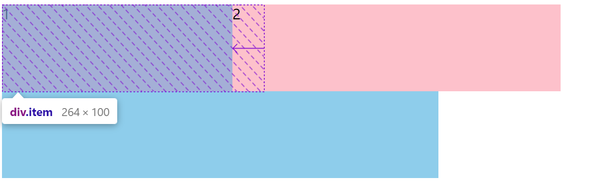

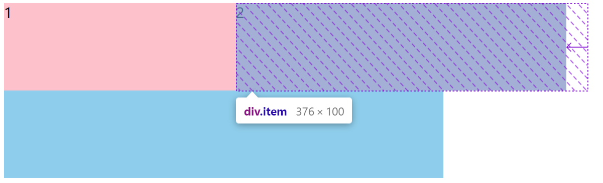

#### 3.flex-basis 

在分配多余空间之前，项目占据的主轴空间（main size）。浏览器根据这个属性，计算主轴是否有多余空间。它的默认值为`auto`，即项目的本来大小。

默认值auto， 指定了flex元素在主轴方向的初始大小。

```css
.container{
    width: 500px;
    height: 200px;
    background-color: skyblue;
    display: flex;
    flex-direction: column;
    /* 主轴变为垂直方向，flex-basis优先级就大于高度*/
}
.item{
    width: 100px;
    height: 100px;
    background-color: pink;
    /* 主轴是水平方向，200覆盖100px宽度 */
    flex-basis: 200px;
}
```

- flex-basis 值

```html
    <style>
        .container{
            width: 500px;
            height: 200px;
            background-color: skyblue;
            display: flex;
            align-items: flex-start;
    
        }
        .item{
            background-color: pink;
            flex-basis: auto; /*0, 0%, auto, px, 100% */
        }
    </style>
</head>
<body>
    <div class="container">
        <div class="item">测试一下</div>
    </div>
</body>
```

#### 4. flex

flex属性是 flex-grow, flex-shrink, flex-basis三个属性的缩写

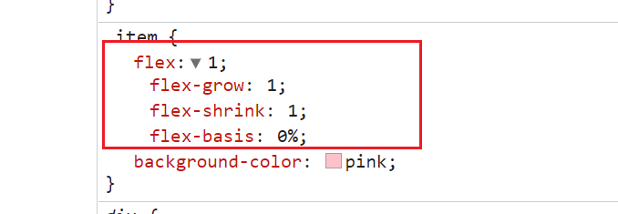

```css
/* flex:1 ; */
flex-grow:1;
flex-shrink:1;
flex-basis:0%;
```

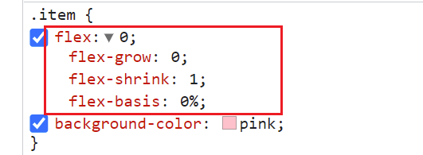

```css
/*flex:0;*/
flex-grow:0;
flex-shrink:1;
flex-basis:0%;
```

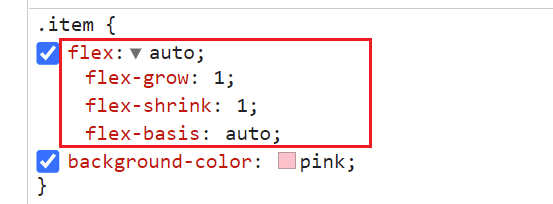

```css
/*flex: auto*/
flex-grow:1;
flex-shrink:1;
flex-basis: auto;
```


思考 flex:1  和 flex：auto； 有什么区别？

如果有三个子元素

flex:1; 

=> flex-grow:1; flex-shrink:1; flex-basis: 0%;   

子元素宽度 = 父级宽度   /  子元素个数

// 每个子元素等比例


width:80px;

flex: auto;   // 本身宽度为80，每个都一样

=> flex-grow:1; flex-shrink:1; flex-basis:auto;

（子元素宽度 = 子元素宽度 +(剩余宽度 *1/3）


flex:1 更适合在等比例列表时使用，flex：auto适用于元素充分利用剩余空间