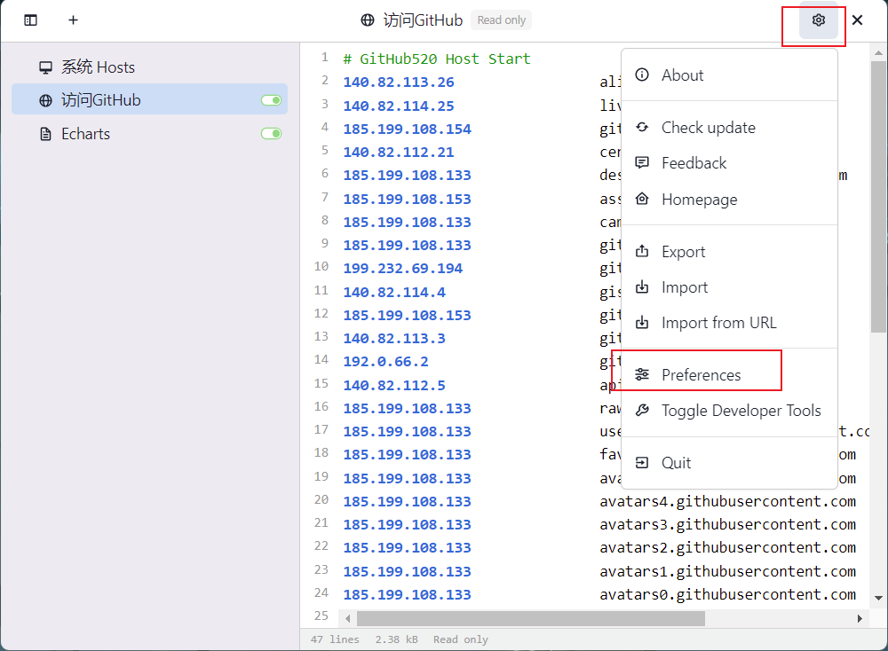
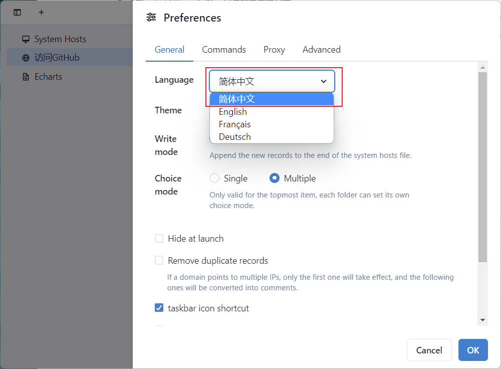
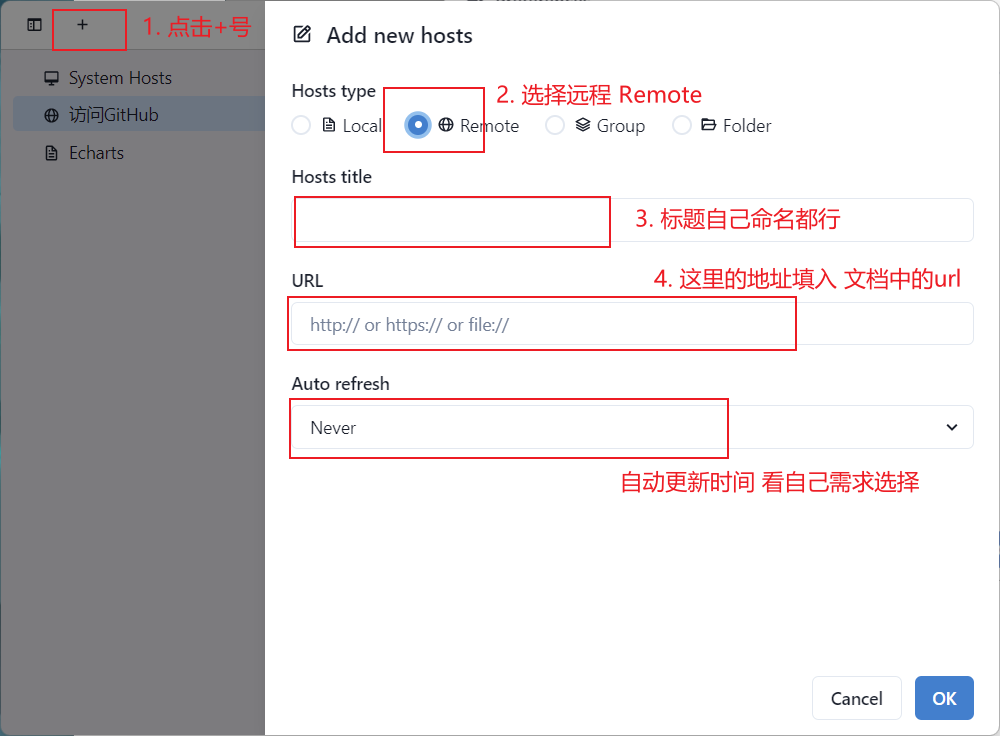
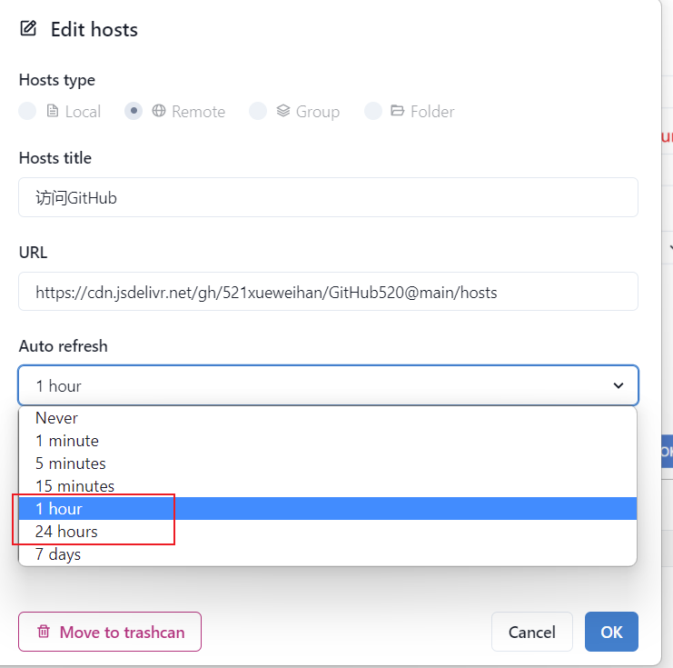
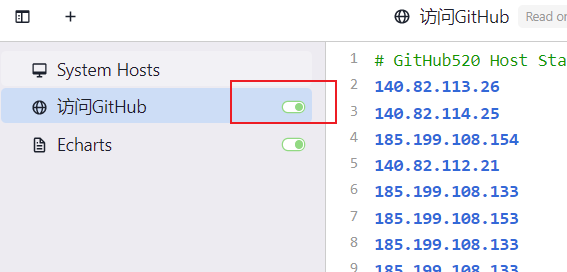

国内访问Github，如果没有科学上网，是否能访问可能需要看人品， 有时ok，有时不ok。

这里感谢李崇辉同学提供的一种动态修改host的方式。 Respect~~~


### 1. 下载SwitchHosts

- https://github.com/oldj/SwitchHosts
- https://swh.app/ 官网下载安装包
- 下载完安装包后， 右键， **以管理员身份打开**



#### 1. 语言修改

在 preferences 偏好选项中修改



#### 2. 配置hosts



**Hosts-URL** 

上图的URL，复制填入这里的地址

```bash
https://cdn.jsdelivr.net/gh/521xueweihan/GitHub520@main/hosts
```

**更新时长**

一天更新一次也可以哈



#### 3. 配置完， 开启配置

- 点击小按钮，开启



---

## DNS

*DNS* （Domain Name System 的缩写）的作用非常简单，就是根据域名查出IP地址。- - 域名系统

每个服务器都有一个IP地址， 我们访问某个服务器下的资源， 中途会经过很多DNS服务器。（没准在哪一个环节就卡住了）

但如果我们在电脑hosts 中配置了 对应域名的 IP地址， 就会直接到那个IP地址去访问网站。 不需要经过中间的过程。  

#### windows 刷新DNS


打开终端（win+R，输入cmd）

```js
输入：ipconfig/flushdns
```

查看现在 github的IP  

```js
终端中输入 ： ping github.com
```


#### Mac刷新DNS

```js
 sudo killall -HUP mDNSResponder
```

