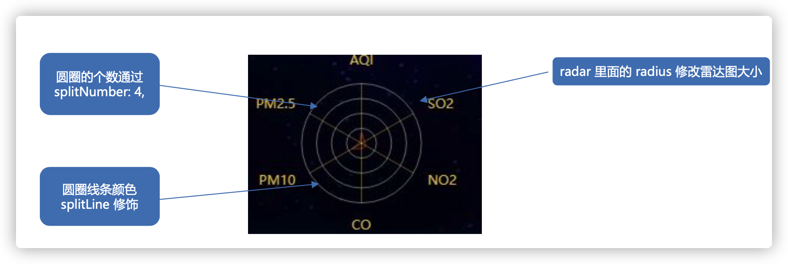
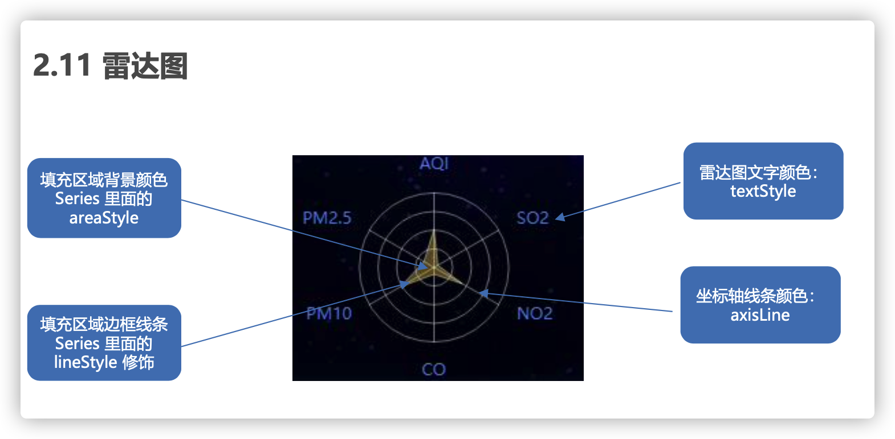
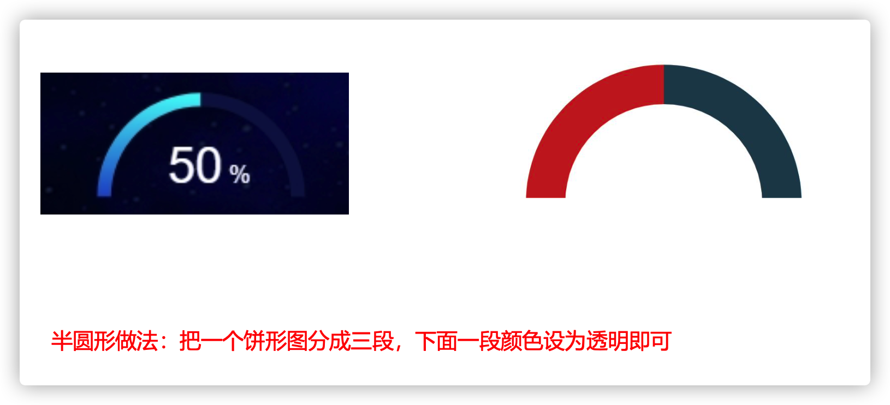
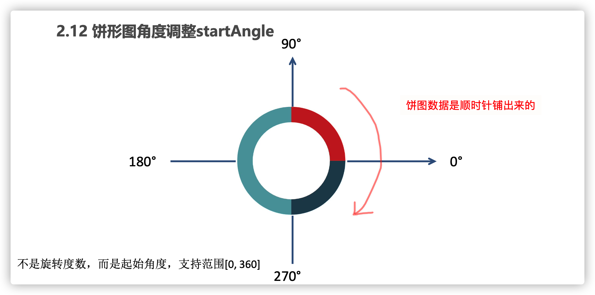

## 1. 渠道分布模块 - 雷达图

```html
            <!-- 渠道分布模块-雷达图 -->
            <div class="wrap">
                <div class="channel panel">
                <div class="inner">
                    <h3>渠道分布</h3>
                    <div class="data">
                    <div class="radar"></div>
                    </div>
                </div>
                </div>
                <div class="quarter panel">
                <div class="inner">
                    <h3>一季度销售进度</h3>
                    <div class="chart">
                    <div class="box">
                        <div class="gauge"></div>
                        <div class="label">75<small> %</small></div>
                    </div>
                    <div class="data">
                        <div class="item">
                        <h4>1,321</h4>
                        <span>
                            <i class="icon-dot" style="color: #6acca3"></i>
                            销售额(万元)
                        </span>
                        </div>
                        <div class="item">
                        <h4>150%</h4>
                        <span>
                            <i class="icon-dot" style="color: #ed3f35"></i>
                            同比增长
                        </span>
                        </div>
                    </div>
                    </div>
                </div>
                </div>
            </div>
```

```css
/* 渠道区块 */
.wrap {
  display: flex;
}
.channel,
.quarter {
  flex: 1;
  height: 2.9rem;
}
.channel {
  margin-right: 0.25rem;
}
.channel .data {
  overflow: hidden;
}
.channel .data .radar {
  height: 2.1rem;
  width: 100%;
  background-color: pink;
}
.channel h4 {
  color: #fff;
  font-size: 0.4rem;
  margin-bottom: 0.0625rem;
}
.channel small {
  font-size: 50%;
}
.channel span {
  display: block;
  color: #4c9bfd;
  font-size: 0.175rem;
}
/* 季度区块 */
.quarter .inner {
  display: flex;
  flex-direction: column;
  margin: 0 -0.075rem;
}
.quarter .chart {
  flex: 1;
  padding-top: 0.225rem;
}
.quarter .box {
  position: relative;
}
.quarter .label {
  transform: translate(-50%, -30%);
  color: #fff;
  font-size: 0.375rem;
  position: absolute;
  left: 50%;
  top: 50%;
}
.quarter .label small {
  font-size: 50%;
}
.quarter .gauge {
  height: 1.05rem;
}
.quarter .data {
  display: flex;
  justify-content: space-between;
}
.quarter .item {
  width: 50%;
}
.quarter h4 {
  color: #fff;
  font-size: 0.3rem;
  margin-bottom: 0.125rem;
}
.quarter span {
  display: block;
  width: 100%;
  white-space: nowrap;
  text-overflow: ellipsis;
  overflow: hidden;
  color: #4c9bfd;
  font-size: 0.175rem;
}

```

```js
;(function(){
    // 1. 实例化echarts对象
    var radarChart = echarts.init(document.querySelector('.radar'))
    // 2. 指定配置项和数据
    var option = {
            tooltip:{
                show: true,
                position: ['60%', '10%']
            },
            radar: {
                // 雷达图的指示器 内部填充数据
                // 圆圈边上的数据
                indicator: [
                    { name: '机场', max: 100 },
                    { name: '商场', max: 100 },
                    { name: '火车站', max: 100 },
                    { name: '汽车站', max: 100 },
                    { name: '地铁', max: 100 }
                ],
                // 雷达图类型  circle  
                // polygon [ˈpɒlɪɡən] 多边形 五角形
                shape: 'circle',
                name: {
                    // 修饰雷达图文本颜色
                    textStyle: {
                    color: '#4c9bfd'
                    }
                },
                // 分割圆圈线条的样式
                splitLine: {
                    lineStyle: {
                    // 从外到内, 透明度依次加高
                    // color: [
                    //     'rgba(238, 197, 102, 0.1)',
                    //     'rgba(238, 197, 102, 0.2)',
                    //     'rgba(238, 197, 102, 0.4)',
                    //     'rgba(238, 197, 102, 0.6)',
                    //     'rgba(238, 197, 102, 0.8)',
                    //     'rgba(238, 197, 102, 1)'
                    // ].reverse()
                    color:'rgba(255, 255, 255, .5)'
                    }
                },
                // 指示器轴的分割段数 圆环数量
                splitNumber: 4,
                splitArea: {
                    show: false
                },
                // 五条深入圆心的轴线, 修改为白色半透明
                axisLine: {
                    show: true,
                    lineStyle: {
                        color: 'rgba(255, 255, 255, 0.5)',
                    }
                },
                center: ['50%', '50%'],
                // 外半径占据容器大小
                radius: '65%',

            },
            series: [
                {
                    name: '北京',
                    type: 'radar',
                    data: [[90, 19, 56, 11, 34]],
                    // 设置图形标记 小拐点
                    symbol: 'circle',
                    // 拐点大小
                    symbolSize: 5,
                    // 拐点颜色修改
                    itemStyle: {
                        color: '#fff'
                    },
                    // 让小圆点旁边 显示数据
                    label: {
                        show: true,
                        color: '#fff',
                        fontSize: 10
                },
                // 填充区域颜色
                areaStyle: {
                        color: 'rgba(238, 197, 102, 0.6)',
                    },
                    // 填充区域线条样式
                    lineStyle: {
                        normal: {
                            color: '#red',
                            width: 1,
                            opacity:0.5
                        }
                    },
                }
            ]
        };
    // 3. 将配置和数据给echarts实例对象
    radarChart.setOption(option)
})()
```





## 2. 季度销售进度制作 - 半圆形饼图





- 起始角度 默认为 90度位置， 我们修改startAngle 可以改变环形起始位置。

```js
//! 5. 销售进度模块 饼图
;(function(){
// 初始化Echarts
var pieChart = echarts.init(document.querySelector('.gauge'))
// 配置项
var option = {
    series: [
      {
        name: '销售进度',
        type: 'pie',
        // 放大图形
        radius: ['130%', '150%'],  
        // 移动下位置  套住50%文字
        center: ['48%', '80%'],  
        // 引导线 不显示
        labelLine: {
          show: false
        },
        // 起始角度 支持范围[0, 360]
        startAngle:180,
        // 鼠标经过不变大
        hoverOffset: 0, 
        data: [
          { value: 100,
            itemStyle: {
            // 颜色渐变#00c9e0->#005fc1
            color: new echarts.graphic.LinearGradient(
              // (x1,y2) 点到点 (x2,y2) 之间进行渐变
              0,
              0,
              0,
              1,
              [
                { offset: 0, color: "#00c9e0" }, // 0 起始颜色
                { offset: 1, color: "#005fc1" } // 1 结束颜色
              ]
            )
          }},
          { value: 100,itemStyle: { color: '#12274d' }},
          { value: 200,itemStyle:{color:'transparent'}},
        ]
      }
    ]
  };
    // 3. 传递给实例
    pieChart.setOption(option)
    // 4. 浏览器缩放, echarts图表也缩放
    window.addEventListener('resize', function(){
        lineChart.resize()
    })
}())
```

## 3. 全国热榜模块的制作

- 真实数据如何渲染到页面
- ES6模板字符串

#### 1. html

```html
      <!-- 排行榜 -->
      <div class="top panel">
        <div class="inner">
          <div class="all">
            <h3>全国热榜</h3>
            <ul>
              <li>
                <i class="icon-cup1" style="color: #d93f36;"></i>
                可爱多
              </li>
              <li>
                <i class="icon-cup2" style="color: #68d8fe;"></i>
                娃哈啥
              </li>
              <li>
                <i class="icon-cup3" style="color: #4c9bfd;"></i>
                喜之郎
              </li>
            </ul>
          </div>
          <div class="province">
            <h3>各省热销 <i class="date">// 近30日 //</i></h3>
            <div class="data">
              <ul class="sup">
                <li>
                  <span>北京</span>
                  <span>25,179 <s class="icon-up"></s></span>
                </li>
                <li>
                  <span>河北</span>
                  <span>23,252 <s class="icon-down"></s></span>
                </li>
                <li>
                  <span>上海</span>
                  <span>20,760 <s class="icon-up"></s></span>
                </li>
                <li>
                  <span>江苏</span>
                  <span>23,252 <s class="icon-down"></s></span>
                </li>
                <li>
                  <span>山东</span>
                  <span>20,760 <s class="icon-up"></s></span>
                </li>
              </ul>
              <ul class="sub">
                <!-- <li><span></span><span> <s class="icon-up"></s></span></li> -->
              </ul>
            </div>
          </div>
        </div>
      </div>
```

#### 2. css

```css
/* 排行榜 */
.top {
  height: 3.5rem;
}
.top .inner {
  display: flex;
}
.top .all {
  display: flex;
  flex-direction: column;
  width: 2.1rem;
  color: #4c9bfd;
  font-size: 0.175rem;
  vertical-align: middle;
}
.top .all ul {
  padding-left: 0.15rem;
  margin-top: 0.15rem;
  flex: 1;
  display: flex;
  flex-direction: column;
  justify-content: space-around;
}
.top .all li {
  overflow: hidden;
}
.top .all [class^="icon-"] {
  font-size: 0.45rem;
  vertical-align: middle;
  margin-right: 0.15rem;
}
.top .province {
  flex: 1;
  display: flex;
  flex-direction: column;
  color: #fff;
}
.top .province i {
  padding: 0 0.15rem;
  margin-top: 0.0625rem;
  float: right;
  font-style: normal;
  font-size: 0.175rem;
  color: #0bace6;
}
.top .province s {
  display: inline-block;
  transform: scale(0.8);
  text-decoration: none;
}
.top .province .icon-up {
  color: #dc3c33;
}
.top .province .icon-down {
  color: #36be90;
}
.top .province .data {
  flex: 1;
  display: flex;
  margin-top: 0.175rem;
}
.top .province ul {
  flex: 1;
  line-height: 1;
  margin-bottom: 0.175rem;
}
.top .province ul li {
  display: flex;
  justify-content: space-between;
}
.top .province ul span {
  display: block;
  overflow: hidden;
  white-space: nowrap;
  text-overflow: ellipsis;
}
.top .province ul.sup {
  font-size: 0.175rem;
}
.top .province ul.sup li {
  color: #4995f4;
  padding: 0.15rem;
}
.top .province ul.sup li.active {
  color: #a3c6f2;
  background-color: rgba(10, 67, 188, 0.2);
}
.top .province ul.sub {
  display: flex;
  flex-direction: column;
  justify-content: space-around;
  font-size: 0.15rem;
  background-color: rgba(10, 67, 188, 0.2);
}
.top .province ul.sub li {
  color: #52ffff;
  padding: 0.125rem 0.175rem;
}
.clock {
  position: absolute;
  top: -0.45rem;
  right: 0.5rem;
  font-size: 0.25rem;
  color: #0bace6;
}
.clock i {
  margin-right: 5px;
  font-size: 0.25rem;
}
@media screen and (max-width: 1600px) {
  .top span {
    transform: scale(0.9);
  }
  .top .province ul.sup li {
    padding: 0.125rem 0.15rem;
  }
  .top .province ul.sub li {
    padding: 0.0625rem 0.15rem;
  }
  .quarter span {
    transform: scale(0.9);
  }
}
```

- 鼠标经过，渲染对应数据
- ES6 模板字符串

```js
// 准备相关数据
	var hotData = [
      {
        city: '北京',  // 城市
        sales: '25, 179',  // 销售额
        flag: true, //  上升还是下降
        brands: [   //  品牌种类数据
          { name: '可爱多', num: '9,086', flag: true },
          { name: '娃哈哈', num: '8,341', flag: true },
          { name: '喜之郎', num: '7,407', flag: false },
          { name: '八喜', num: '6,080', flag: false },
          { name: '小洋人', num: '6,724', flag: false },
          { name: '好多鱼', num: '2,170', flag: true },
        ]
      },
      {
        city: '河北',
        sales: '23,252',
        flag: false,
        brands: [
          { name: '可爱多', num: '3,457', flag: false },
          { name: '娃哈哈', num: '2,124', flag: true },
          { name: '喜之郎', num: '8,907', flag: false },
          { name: '八喜', num: '6,080', flag: true },
          { name: '小洋人', num: '1,724', flag: false },
          { name: '好多鱼', num: '1,170', flag: false },
        ]
      },
      {
        city: '上海',
        sales: '20,760',
        flag: true,
        brands: [
          { name: '可爱多', num: '2,345', flag: true },
          { name: '娃哈哈', num: '7,109', flag: true },
          { name: '喜之郎', num: '3,701', flag: false },
          { name: '八喜', num: '6,080', flag: false },
          { name: '小洋人', num: '2,724', flag: false },
          { name: '好多鱼', num: '2,998', flag: true },
        ]
      },
      {
        city: '江苏',
        sales: '23,252',
        flag: false,
        brands: [
          { name: '可爱多', num: '2,156', flag: false },
          { name: '娃哈哈', num: '2,456', flag: true },
          { name: '喜之郎', num: '9,737', flag: true },
          { name: '八喜', num: '2,080', flag: true },
          { name: '小洋人', num: '8,724', flag: true },
          { name: '好多鱼', num: '1,770', flag: false },
        ]
      },
       {
        city: '山东',
        sales: '20,760',
        flag: true,
        brands: [
          { name: '可爱多', num: '9,567', flag: true },
          { name: '娃哈哈', num: '2,345', flag: false },
          { name: '喜之郎', num: '9,037', flag: false },
          { name: '八喜', num: '1,080', flag: true },
          { name: '小洋人', num: '4,724', flag: false },
          { name: '好多鱼', num: '9,999', flag: true },
        ]
      }
    ]
```

- index.js

#### 3. 根据数据渲染各省模块内容

- 删掉原先自带小li
- 遍历数据 $.each()
- 拼接字符串把数据渲染到 li 的span 里面
- 追加给 .sup 盒子

```js
// 2. 遍历数据
var tabHTML = ''
$.each(hotData, function(i, el){
    tabHTML += `<li><span>${el.city}</span>
                    <span> ${el.sales}</span><s class=${el.flag ? 'icon-up' : 'icon-down'}></s></span>
                </li>`
    $('.sup').html(tabHTML)
})

// 3. 鼠标经过小li高亮显示
$('.province .sup').on('mouseenter', 'li', function(){
    $(this).addClass('active').siblings('li').removeClass()

    // 拿到当前城市的索引号
    console.log($(this).index())
    index = $(this).index()
    // 可以通过hotData[index] 拿到当前的城市数据
    // console.log(hotData[index])
    // 拿到品牌种类
    var brands = hotData[index].brands
    // 遍历品牌数组
    var contentHTML = ''
    $.each(brands, function(i,item){
        // item 是每一个品牌对象
        console.log(item)
        contentHTML += `<li><span>${item.name}</span><span>${item.num}<s class=${item.flag ? "icon-up" : "icon-down"}}}></s></span></li>`
        $('.sub').html(contentHTML)
    })
    console.log(brands)

})

// 4. 默认激活第一个li
// 所有的LI
var $lis = $('.province .sup li')
// 第一个默认激活
$lis.eq(0).mouseenter()

// 声明一个 渲染函数, 设置 xiaoli高亮,
var render = function(currentElem) {
    // start
    currentElem.addClass('active').siblings('li').removeClass()

    // 拿到品牌种类
    var brands = hotData[index].brands
    // 遍历品牌数组
    var contentHTML = ''
    $.each(brands, function(i,item){
        // item 是每一个品牌对象
        console.log(item)
        contentHTML += `<li><span>${item.name}</span><span>${item.num}<s class=${item.flag ? "icon-up" : "icon-down"}}}></s></span></li>`
        $('.sub').html(contentHTML)
    })
}

// 5. 开启定时器
var index = 0 
var timer = setInterval(function(){
    index++
    if (index >= 5) index = 0
    // $lis.eq(index).mouseenter()
    render($lis.eq(index))

}, 2000)

$('.province .sup').hover(function(){
    clearInterval(timer)
}, function(){
    timer = setInterval(function(){
        index++
        if (index >= 5) index = 0
        // $lis.eq(index).mouseenter()
        render($lis.eq(index))
    }, 2000)
})
// end
}())
```


## 4. 地图模块

[gallery 停止服务](http://www-quic.zhihu.com/question/513511544)

- 社区替换
  - https://www.isqqw.com/
  - https://madeapie.com/
  - www.makeapie.cn 推荐这个
  - https://www.makeapie.cn/echarts_content/x0-ExSkZDM.html

ECharts 之前提供下载的矢量地图数据来自第三方，由于部分数据不符合国家《测绘法》规定，目前暂时停止下载服务。

```js
;(function(){
    var mapChart = echarts.init(document.querySelector('.geo'))
    var geoCoordMap = {
        '上海': [121.4648,31.2891],
        '东莞': [113.8953,22.901],
        '东营': [118.7073,37.5513],
        '中山': [113.4229,22.478],
        '临汾': [111.4783,36.1615],
        '临沂': [118.3118,35.2936],
        '丹东': [124.541,40.4242],
        '丽水': [119.5642,28.1854],
        '乌鲁木齐': [87.9236,43.5883],
        '佛山': [112.8955,23.1097],
        '保定': [115.0488,39.0948],
        '兰州': [103.5901,36.3043],
        '包头': [110.3467,41.4899],
        '北京': [116.4551,40.2539],
        '北海': [109.314,21.6211],
        '南京': [118.8062,31.9208],
        '南宁': [108.479,23.1152],
        '南昌': [116.0046,28.6633],
        '南通': [121.1023,32.1625],
        '厦门': [118.1689,24.6478],
        '台州': [121.1353,28.6688],
        '合肥': [117.29,32.0581],
        '呼和浩特': [111.4124,40.4901],
        '咸阳': [108.4131,34.8706],
        '哈尔滨': [127.9688,45.368],
        '唐山': [118.4766,39.6826],
        '嘉兴': [120.9155,30.6354],
        '大同': [113.7854,39.8035],
        '大连': [122.2229,39.4409],
        '天津': [117.4219,39.4189],
        '太原': [112.3352,37.9413],
        '威海': [121.9482,37.1393],
        '宁波': [121.5967,29.6466],
        '宝鸡': [107.1826,34.3433],
        '宿迁': [118.5535,33.7775],
        '常州': [119.4543,31.5582],
        '广州': [113.5107,23.2196],
        '廊坊': [116.521,39.0509],
        '延安': [109.1052,36.4252],
        '张家口': [115.1477,40.8527],
        '徐州': [117.5208,34.3268],
        '德州': [116.6858,37.2107],
        '惠州': [114.6204,23.1647],
        '成都': [103.9526,30.7617],
        '扬州': [119.4653,32.8162],
        '承德': [117.5757,41.4075],
        '拉萨': [91.1865,30.1465],
        '无锡': [120.3442,31.5527],
        '日照': [119.2786,35.5023],
        '昆明': [102.9199,25.4663],
        '杭州': [119.5313,29.8773],
        '枣庄': [117.323,34.8926],
        '柳州': [109.3799,24.9774],
        '株洲': [113.5327,27.0319],
        '武汉': [114.3896,30.6628],
        '汕头': [117.1692,23.3405],
        '江门': [112.6318,22.1484],
        '沈阳': [123.1238,42.1216],
        '沧州': [116.8286,38.2104],
        '河源': [114.917,23.9722],
        '泉州': [118.3228,25.1147],
        '泰安': [117.0264,36.0516],
        '泰州': [120.0586,32.5525],
        '济南': [117.1582,36.8701],
        '济宁': [116.8286,35.3375],
        '海口': [110.3893,19.8516],
        '淄博': [118.0371,36.6064],
        '淮安': [118.927,33.4039],
        '深圳': [114.5435,22.5439],
        '清远': [112.9175,24.3292],
        '温州': [120.498,27.8119],
        '渭南': [109.7864,35.0299],
        '湖州': [119.8608,30.7782],
        '湘潭': [112.5439,27.7075],
        '滨州': [117.8174,37.4963],
        '潍坊': [119.0918,36.524],
        '烟台': [120.7397,37.5128],
        '玉溪': [101.9312,23.8898],
        '珠海': [113.7305,22.1155],
        '盐城': [120.2234,33.5577],
        '盘锦': [121.9482,41.0449],
        '石家庄': [114.4995,38.1006],
        '福州': [119.4543,25.9222],
        '秦皇岛': [119.2126,40.0232],
        '绍兴': [120.564,29.7565],
        '聊城': [115.9167,36.4032],
        '肇庆': [112.1265,23.5822],
        '舟山': [122.2559,30.2234],
        '苏州': [120.6519,31.3989],
        '莱芜': [117.6526,36.2714],
        '菏泽': [115.6201,35.2057],
        '营口': [122.4316,40.4297],
        '葫芦岛': [120.1575,40.578],
        '衡水': [115.8838,37.7161],
        '衢州': [118.6853,28.8666],
        '西宁': [101.4038,36.8207],
        '西安': [109.1162,34.2004],
        '贵阳': [106.6992,26.7682],
        '连云港': [119.1248,34.552],
        '邢台': [114.8071,37.2821],
        '邯郸': [114.4775,36.535],
        '郑州': [113.4668,34.6234],
        '鄂尔多斯': [108.9734,39.2487],
        '重庆': [107.7539,30.1904],
        '金华': [120.0037,29.1028],
        '铜川': [109.0393,35.1947],
        '银川': [106.3586,38.1775],
        '镇江': [119.4763,31.9702],
        '长春': [125.8154,44.2584],
        '长沙': [113.0823,28.2568],
        '长治': [112.8625,36.4746],
        '阳泉': [113.4778,38.0951],
        '青岛': [120.4651,36.3373],
        '韶关': [113.7964,24.7028]
    };

    var XAData = [
        [{name:'西安'}, {name:'北京',value:100}],
        [{name:'西安'}, {name:'上海',value:100}],
        [{name:'西安'}, {name:'广州',value:100}],
        [{name:'西安'}, {name:'西宁',value:100}],
        [{name:'西安'}, {name:'拉萨',value:100}]
    ];

    var XNData = [
        [{name:'西宁'}, {name:'北京',value:100}],
        [{name:'西宁'}, {name:'上海',value:100}],
        [{name:'西宁'}, {name:'广州',value:100}],
        [{name:'西宁'}, {name:'西安',value:100}],
        [{name:'西宁'}, {name:'银川',value:100}]
    ];

    var YCData = [
        [{name:'银川'}, {name:'北京',value:100}],
        [{name:'银川'}, {name:'广州',value:100}],
        [{name:'银川'}, {name:'上海',value:100}],
        [{name:'银川'}, {name:'西安',value:100}],
        [{name:'银川'}, {name:'西宁',value:100}],
    ];

    var planePath = 'path://M1705.06,1318.313v-89.254l-319.9-221.799l0.073-208.063c0.521-84.662-26.629-121.796-63.961-121.491c-37.332-0.305-64.482,36.829-63.961,121.491l0.073,208.063l-319.9,221.799v89.254l330.343-157.288l12.238,241.308l-134.449,92.931l0.531,42.034l175.125-42.917l175.125,42.917l0.531-42.034l-134.449-92.931l12.238-241.308L1705.06,1318.313z';
    //var planePath = 'arrow';
    var convertData = function (data) {
            
        var res = [];
        for (var i = 0; i < data.length; i++) {
            
            var dataItem = data[i];

            var fromCoord = geoCoordMap[dataItem[0].name];
            var toCoord = geoCoordMap[dataItem[1].name];
            if (fromCoord && toCoord) {
                res.push({
                    fromName: dataItem[0].name,
                    toName: dataItem[1].name,
                    coords: [fromCoord, toCoord],
                    value: dataItem[1].value
                });
            }
        }
        return res;
           
    };

    var color = ['#a6c84c', '#ffa022', '#46bee9'];//航线的颜色
    var series = [];
    [['西安', XAData], ['西宁', XNData], ['银川', YCData]].forEach(function (item, i) {  
        series.push({
            name: item[0] + ' Top3',
            type: 'lines',
            zlevel: 1,
            effect: {
                show: true,
                period: 6,
                trailLength: 0.7,
                color: 'red',   //arrow箭头的颜色
                symbolSize: 3
            },
            lineStyle: {
                normal: {
                    color: color[i],
                    width: 0,
                    curveness: 0.2
                }
            },
            data: convertData(item[1])
        },
        {
            name: item[0] + ' Top3',
            type: 'lines',
            zlevel: 2,
            symbol: ['none', 'arrow'],
            symbolSize: 10,
            effect: {
                show: true,
                period: 6,
                trailLength: 0,
                symbol: planePath,
                symbolSize: 15
            },
            lineStyle: {
                normal: {
                    color: color[i],
                    width: 1,
                    opacity: 0.6,
                    curveness: 0.2
                }
            },
            data: convertData(item[1])
        },
        {
            name: item[0] + ' Top3',
            type: 'effectScatter',
            coordinateSystem: 'geo',
            zlevel: 2,
            rippleEffect: {
                brushType: 'stroke'
            },
            label: {
                normal: {
                    show: true,
                    position: 'right',
                    formatter: '{b}'
                }
            },
            symbolSize: function (val) {
                return val[2] / 8;
            },
            itemStyle: {
                normal: {
                    color: color[i],
                },
                emphasis: {
                    areaColor: '#2B91B7'
                }
            },
            data: item[1].map(function (dataItem) {
                return {
                    name: dataItem[1].name,
                    value: geoCoordMap[dataItem[1].name].concat([dataItem[1].value])
                };
            })
        });
    });
    var option = {
        title : {
            text: '模拟航线',
            subtext: '数据纯属虚构',
            left: 'center',
            textStyle : {
                color: '#fff'
            }
        },
        tooltip : {
            trigger: 'item', 
            formatter:function(params, ticket, callback){
                if(params.seriesType=="effectScatter") {
                    return "线路："+params.data.name+""+params.data.value[2];
                }else if(params.seriesType=="lines"){
                    return params.data.fromName+">"+params.data.toName+"<br />"+params.data.value;
                }else{
                    return params.name;
                }
            } 
        },
        legend: {
            orient: 'vertical',
            top: 'bottom',
            left: 'right',
            data:['西安 Top3', '西宁 Top3', '银川 Top3'],
            textStyle: {
                color: '#fff'
            },
            selectedMode: 'multiple'
        },
        geo: {
            map: 'china',
            zoom: 1.2,
            label: {
                emphasis: {
                    show: true,
                    color:'#fff'
                }
            },
            roam: true,
            itemStyle: {
                normal: {
                    areaColor: '#00186E',
                    borderColor: '#195BB9',
                    borderWidth: 1,
                },
                emphasis: {
                    areaColor: '#2B91B7'
                }
            }
        },
        series: series
    };
    mapChart.setOption(option)
}())
```


